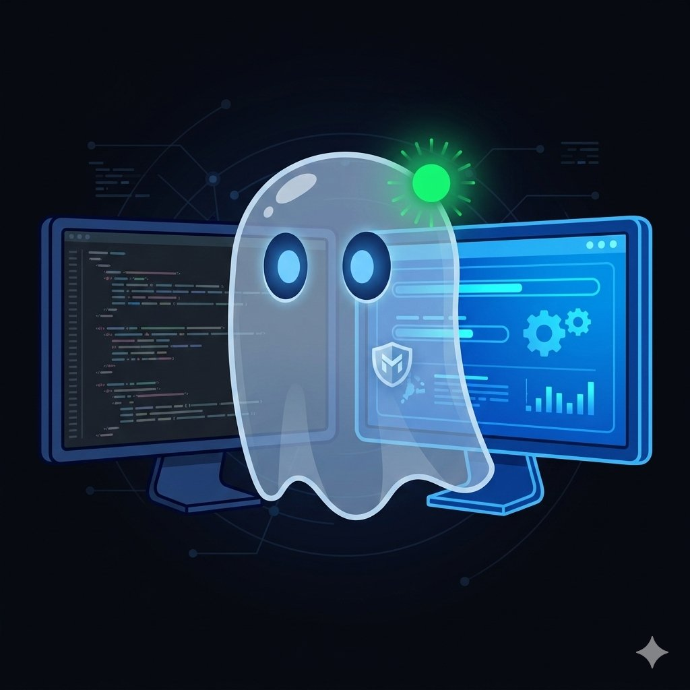

# 👻 Marlow

> **AI that works beside you, not instead of you.**

<p align="center">
  
</p>

<p align="center">
  <a href="#-quick-start">Quick Start</a> •
  <a href="#-features">Features</a> •
  <a href="#-security">Security</a> •
  <a href="#-vs-competition">vs Competition</a> •
  <a href="#-español">Español 🇪🇸</a>
</p>

---

## The Problem

Existing Windows automation MCP servers take over your mouse and keyboard. **You stop working so the AI can work.**

## The Solution

Marlow works **in parallel** with you. Background mode. Real-time audio. Security from commit #1. And yes, it speaks Spanish.

---

## ⚡ Quick Start

```bash
pip install marlow-mcp
```

Add to your MCP client config file:

```json
{
  "mcpServers": {
    "marlow": {
      "command": "marlow"
    }
  }
}
```

Restart your MCP client. Done. 👻

---

## ✨ Features

### 27 Tools (Phase 1 + Phase 2)

| Category | Tools | Description |
|----------|-------|-------------|
| 🔍 Vision | `get_ui_tree` | Read any window's structure — **0 tokens** |
| 📸 Capture | `take_screenshot` | Screen, window, or region capture |
| 🖱️ Mouse | `click` | Click by element name (silent) or coordinates |
| ⌨️ Keyboard | `type_text`, `press_key`, `hotkey` | Type and shortcuts — silent mode available |
| 🪟 Windows | `list_windows`, `focus_window`, `manage_window` | Full window management |
| 💻 System | `run_command`, `open_application`, `clipboard`, `system_info` | Shell, apps, clipboard |
| 🔒 Safety | `kill_switch` | Emergency stop — halt everything instantly |

### Background Mode (Silent Methods)

Marlow tries **silent methods first** — clicking, typing, and interacting with apps **without taking your mouse or keyboard**:

```
invoke()       → Click buttons without moving mouse
set_edit_text() → Type without keyboard simulation
select()       → Pick menu items silently
toggle()       → Check/uncheck boxes silently
```

If silent methods don't work for an app, Marlow falls back to real input automatically.

---

## 🔒 Security — Our #1 Differentiator

> **Built from commit #1. Not 34 patches later.**

| Layer | What it does |
|-------|-------------|
| **Kill Switch** | `Ctrl+Shift+Escape` stops ALL automation instantly |
| **Confirmation Mode** | Every action requires approval (default for new users) |
| **Blocked Apps** | Banking, password managers, auth apps — never accessed |
| **Blocked Commands** | `format`, `del /f`, `rm -rf`, `shutdown` — always blocked |
| **Data Sanitization** | Credit cards, SSNs, passwords — redacted before sending to AI |
| **Zero Telemetry** | No data ever leaves your machine. **Ever.** |
| **Encrypted Logs** | Full audit trail with AES-256 encryption |

---

## 🆚 vs Competition

| Feature | Windows-MCP | MCPControl | sbroenne | **Marlow** |
|---------|------------|-----------|---------|-----------|
| Desktop control | ✅ | ✅ | ✅ | ✅ |
| Silent/background methods | ❌ | ❌ | ❌ | ✅ |
| Kill switch | ❌ | ❌ | ❌ | ✅ |
| Data sanitization | ❌ | ❌ | ❌ | ✅ |
| Confirmation mode | ❌ | ❌ | ❌ | ✅ |
| Blocked apps list | ❌ | ❌ | ❌ | ✅ |
| Telemetry | ⚠️ Yes | ❌ | ❌ | **Never** |
| Encrypted logs | ❌ | ❌ | ❌ | ✅ |
| Spanish docs | ❌ | ❌ | ❌ | ✅ |

### Phase 2 (Shipped)
- 🖥️ **Dual-screen mode** — Agent works on screen 2 while you use screen 1
- 🎤 **Audio capture** — System audio + mic with local Whisper transcription
- 🗣️ **Voice control** — Talk to Marlow, no typing needed
- 🎨 **COM Automation** — Script Photoshop, Office, and more directly
- 🔍 **OCR** — Read text from images and uncooperative apps
- 🎯 **Smart Find** — Finds UI elements using UIA, OCR, or screenshot escalation

---

## ⚙️ Configuration

Marlow creates `~/.marlow/config.json` on first run:

```json
{
  "security": {
    "confirmation_mode": "all",
    "kill_switch_enabled": true,
    "max_actions_per_minute": 30
  },
  "automation": {
    "default_backend": "uia",
    "prefer_silent_methods": true
  },
  "language": "auto"
}
```

### Confirmation Modes

| Mode | Behavior | Recommended for |
|------|----------|----------------|
| `all` | Every action needs approval | New users (default) |
| `sensitive` | Only destructive/sensitive actions | Regular users |
| `autonomous` | No confirmation needed | Power users |

---

## 🛠️ Development

```bash
git clone https://github.com/jarb02/marlow.git
cd marlow
pip install -e ".[dev]"
```

---

## 📄 License

MIT — Free and open source. See [LICENSE](LICENSE).

---

## 🔐 Security Policy

Found a vulnerability? Please report it responsibly. See [SECURITY.md](.github/SECURITY.md).

---

<a name="-español"></a>
## 🇪🇸 Español

### Marlow — AI que trabaja a tu lado, no en tu lugar.

Los servidores MCP de automatización para Windows existentes toman control de tu mouse y teclado. **Tú dejas de trabajar para que el AI trabaje.**

Marlow trabaja **en paralelo** contigo. Modo background. Audio en tiempo real. Seguridad desde el primer commit. Y sí, habla español.

### Instalación rápida

```bash
pip install marlow-mcp
```

### Seguridad — Nuestro Diferenciador #1

- **Kill Switch:** `Ctrl+Shift+Escape` detiene TODO inmediatamente
- **Modo Confirmación:** Cada acción requiere aprobación (por defecto)
- **Apps Bloqueadas:** Bancos, gestores de contraseñas — nunca se acceden
- **Comandos Bloqueados:** Comandos destructivos siempre bloqueados
- **Sanitización de Datos:** Tarjetas de crédito, SSN, contraseñas — redactados antes de enviar al AI
- **Cero Telemetría:** Tus datos nunca salen de tu máquina. **Nunca.**

### ¿Issues en español?

¡Sí! Los issues en español son bienvenidos. Usa la etiqueta `español` al crear tu issue.

---

<p align="center">
  
  <br>
  <em>👻 Marlow — Your friendly ghost in the machine</em>
</p>
